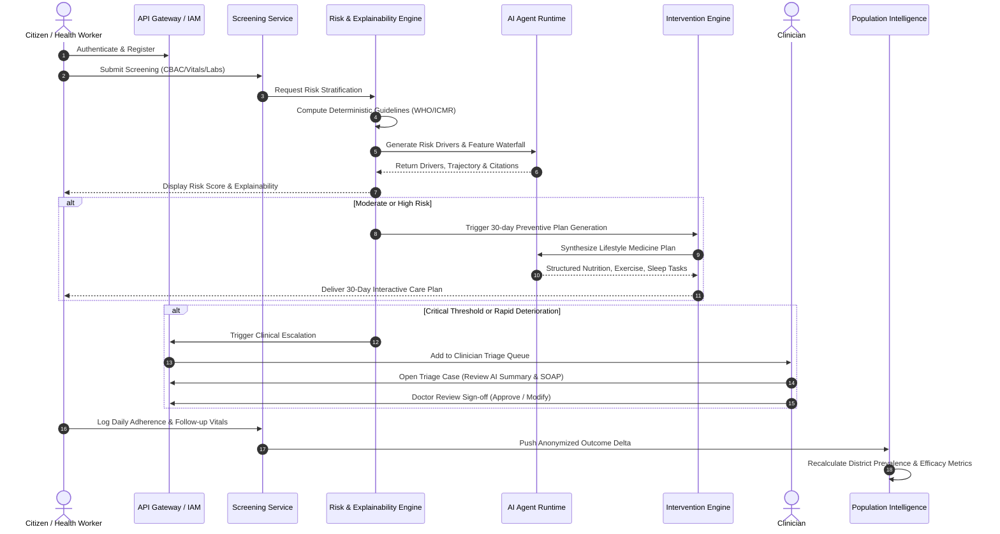

# SevaHealth AI: System Architecture Specification

**Document Version:** 1.0.0  
**Target:** Seva First Innovation Challenge  
**Mission:** AI-native preventive-health and NCD early-warning platform  
**Core Loop:** `SCREEN → UNDERSTAND → RISK STRATIFY → PREDICT → INTERVENE → MONITOR → ESCALATE → LEARN`

---

## 1. High-Level Architecture Overview

SevaHealth AI is architected as an AI-native, modular microservices platform designed for high clinical safety, multi-tenant public health deployment, and strict human-in-the-loop governance.

The platform provides dedicated interfaces for three key stakeholder tiers:
1. **Citizens:** Mobile/Web interface for guided screening, explainable risk breakdown, personalized 30-day preventive intervention plans, and wearable health tracking.
2. **Healthcare Workers & Clinicians:** Triage inbox for escalating cases, longitudinal physiological trends, AI-synthesized clinical summaries (with explicit non-diagnostic boundaries), and care-plan approval workflows.
3. **Public Health Administrators:** Population-level epidemiological dashboards, district/ward prevalence heatmaps, demographic risk disparities, and intervention outcome efficacy metrics.

```
                          +-------------------------------------------------------+
                          |                   CLIENT APPLICATIONS                 |
                          |  +--------------------+       +--------------------+  |
                          |  | Citizen Mobile App |       | Next.js Web Portal |  |
                          |  | (Flutter / Native) |       | (Citizen/Clinician)|  |
                          |  +---------+----------+       +---------+----------+  |
                          +------------|----------------------------|-------------+
                                       | HTTPS (REST / SSE)         | HTTPS
                                       v                            v
                          +-------------------------------------------------------+
                          |             API GATEWAY & SECURITY LAYER              |
                          |  (FastAPI / Reverse Proxy, Rate Limiter, JWT Auth)    |
                          +----------------------------+--------------------------+
                                                       |
        +----------------------------------------------+----------------------------------------------+
        |                                                                                             |
+-------v---------+  +-----------------+  +-----------------+  +-----------------+  +-----------------+
|   IAM SERVICE   |  | CITIZEN PROFILE |  | SCREENING SRVC  |  |   RISK ENGINE   |  | INTERVENTION    |
| (RBAC, Tenants, |  | (Demographics,  |  | (CBAC, IDRS,    |  | (WHO-SEAR,      |  | ENGINE          |
|  Audit Tokens)  |  |  ABHA ID, EMPI) |  |  Vitals, Labs)  |  |  ICMR-INDIAB,   |  | (30-day habits, |
|                 |  |                 |  |                 |  |  SHAP Drivers)  |  |  Care Plans)    |
+-------+---------+  +--------+--------+  +--------+--------+  +--------+--------+  +--------+--------+
        |                     |                    |                    |                    |
+-------v---------+  +--------v--------+  +--------v--------+  +--------v--------+  +--------v--------+
| CLINICAL SRVC   |  | WEARABLE SRVC   |  | DOCUMENT SRVC   |  | NOTIFICATION    |  | POPULATION      |
| (Triage queue,  |  | (Normalized     |  | (S3/MinIO vault,|  | SERVICE         |  | INTELLIGENCE    |
|  SOAP summary,  |  |  biometrics: HR,|  |  Lab reports,   |  | (Alerts, SMS,   |  | (Epidemiology,  |
|  Clinician sign)|  |  HRV, Sleep)    |  |  ECG, PDF/MIME) |  |  Escalations)   |  |  Outcome delta) |
+-------+---------+  +--------+--------+  +--------+--------+  +--------+--------+  +--------+--------+
        |                     |                    |                    |                    |
        +---------------------+--------------------+--------------------+--------------------+
                                                       |
                                      +----------------v----------------+
                                      |     AI AGENT RUNTIME & SAFETY   |
                                      |  - Model Provider Abstraction   |
                                      |  - Strict Non-Diagnostic Rails  |
                                      |  - Explainability & Citations   |
                                      |  - MCP Tool Registry Interface  |
                                      +----------------+----------------+
                                                       |
                                      +----------------v----------------+
                                      |      CLINICAL DATA LAYER        |
                                      |  +---------------------------+  |
                                      |  | PostgreSQL (Core Relational|  |
                                      |  |  & FHIR R4 JSON Storage)  |  |
                                      |  +---------------------------+  |
                                      |  | Redis (Cache & Event Bus) |  |
                                      |  +---------------------------+  |
                                      |  | MinIO / S3 Object Storage |  |
                                      |  +---------------------------+  |
                                      |  | OpenTelemetry Collector   |  |
                                      +---------------------------------+
```

---

## 2. Core Service Responsibilities

### 2.1. IAM & Security Service (adapted from `bezs-iam`)
* Manages multi-tenant organization boundaries (e.g., State Health Department → District → Primary Health Center).
* Enforces Role-Based Access Control (RBAC):
  - `CITIZEN`: Read own profile, submit screening, view personal interventions.
  - `HEALTH_WORKER`: Enter screening for citizens in assigned village/ward, view follow-ups.
  - `CLINICIAN`: Review escalated cases, approve care plans, generate clinical summaries.
  - `PUBLIC_HEALTH_ADMIN`: Access de-identified population analytics, trends, resource allocations.
  - `SYSTEM_ADMIN`: Platform operations, tenant provisioning, system health monitoring.
* Issues cryptographically signed JWTs with explicit claims (`tenant_id`, `role`, `user_id`, `scope`).

### 2.2. Citizen & Profile Service
* Manages demographic records, contact details, and emergency contacts.
* Compatible with India's Ayushman Bharat Digital Mission (ABDM) ABHA ID format and Enterprise Master Patient Index (EMPI).
* Tracks explicit patient consent directives for AI-assisted risk screening and clinician data sharing.

### 2.3. Screening Service (adapted from `DrGodly-Mobile-App` & `bezs-pipeline`)
* Orchestrates non-communicable disease screening instruments:
  - **CBAC:** Community Based Assessment Checklist (National Health Mission standard for NCD screening).
  - **IDRS:** Indian Diabetes Risk Score (Age, Physical Activity, Family History, Waist Circumference).
  - **WHO/ISH Cardiovascular Risk Charts:** Age, gender, smoking status, systolic BP, diabetes status.
  - **FINDRISC & ADA Risk Criteria:** Extended metabolic and diabetes risk surveys.
* Ingests physiological vitals (Blood Pressure, Heart Rate, SpO2, BMI, Waist-to-Hip Ratio) and lab values (HbA1c, Fasting Blood Glucose, Lipid Profile, eGFR).

### 2.4. Risk & Explainability Engine
* Evaluates multivariable clinical risk scores across core NCD domains:
  1. **Diabetes & Prediabetes:** Impaired fasting glucose, elevated HbA1c, IDRS score.
  2. **Hypertension:** Systolic/Diastolic staging (Normal, Elevated, Stage 1, Stage 2, Hypertensive Urgency).
  3. **Cardiovascular Risk:** 10-year ASCVD risk stratification (Low <10%, Moderate 10-20%, High >20%).
  4. **Metabolic Syndrome & Obesity:** Waist circumference, triglyceride/HDL ratio, BMI.
  5. **Chronic Kidney Disease (CKD):** eGFR and proteinuria progression markers.
  6. **Metabolic Liver / NAFLD:** FIB-4 score calculation from ALT, AST, age, platelets.
* **Explainability Model:** Produces feature attribution waterfalls (SHAP-style drivers):
  - Identifies top contributing risk drivers (e.g., *Elevated Systolic BP (+22%)*, *Physical Inactivity (+15%)*).
  - Identifies protective factors (e.g., *Non-Smoker (-12%)*, *Normal Waist Circumference (-8%)*).
  - Determines longitudinal risk trajectory (*Improving*, *Stable*, *Deteriorating*).

### 2.5. Preventive Intervention Engine
* Formulates evidence-based, actionable **30-day personalized preventive care plans**.
* Structured across four lifestyle medicine pillars:
  1. **Nutrition:** Evidence-backed dietary adjustments (e.g., reducing glycemic load, salt reduction, increased dietary fiber based on ICMR-NIN guidelines).
  2. **Physical Activity:** Graduated aerobic and resistance targets (e.g., 150 minutes/week moderate walking, daily step milestones).
  3. **Sleep Hygiene & Recovery:** Regular circadian schedules, sleep duration optimization.
  4. **Stress & Lifestyle:** Stress reduction techniques, tobacco cessation support.
* Generates daily checklist tasks and tracks completion adherence rates.

### 2.6. AI Agent Runtime & Clinical Safety Rails (adapted from `refactoragent`)
* Houses the multi-provider LLM abstraction layer (supporting Google Gemini, OpenAI, Anthropic, and deterministic offline mock fallback).
* Enforces strict clinical safety guardrails:
  - Non-diagnostic boundary enforcement: Flags any probabilistic output with `"Clinical review recommended"`.
  - Prohibits autonomous prescription, diagnostic labeling, or emergency dispatch without human sign-off.
  - Appends confidence intervals, guideline citations (e.g., *ICMR Guidelines 2023*, *WHO SEAR Package*), and human-review states.

### 2.7. Clinical & Triage Service (adapted from `bezs-hms`)
* Operates the high-risk clinician triage queue.
* Automatically escalates citizens exhibiting critical physiological thresholds (e.g., Systolic BP > 160 mmHg, Fasting Glucose > 200 mg/dL, or rapid upward risk trajectory).
* Provides the clinician with an AI-synthesized pre-consultation summary and preliminary SOAP draft.
* Records explicit clinician review actions: `ACCEPTED`, `MODIFIED`, or `REJECTED`, complete with doctor identity and timestamp.

### 2.8. Wearable & Biometrics Service (adapted from `open-wearables`)
* Ingests and normalizes continuous physiological timeseries data from consumer smartwatches and sensors.
* Computes rolling 7-day and 30-day baselines for:
  - Resting Heart Rate (RHR)
  - Heart Rate Variability (HRV SDNN and rMSSD)
  - Sleep stages (Deep, REM, Light, Awake)
  - Daily step count and active minutes.
* Detects autonomic nervous system strain and physiological recovery deficits as leading indicators of lifestyle deterioration.

### 2.9. Document Service (adapted from `bezs-filenest`)
* Interfaces with S3 / MinIO storage for secure medical document archiving.
* Enforces MIME-type safety, hash verification, and presigned time-limited access URLs.
* Enables citizens and healthcare workers to attach lab PDF reports and ECG scans to clinical encounters.

### 2.10. Population Health Intelligence
* Aggregates anonymized screening and risk outcomes across geographic cohorts (State, District, Primary Health Centre / Ward).
* Generates epidemiological intelligence:
  - Prevalence heatmaps for pre-hypertension and pre-diabetes.
  - Cohort risk distribution (Low, Moderate, High, Critical).
  - **Intervention Efficacy / Outcome Delta:** Answers the critical question: *"Did high adherence to the 30-day intervention plan actually reduce average blood pressure or HbA1c in this population group?"*

### 2.11. Audit & Observability (adapted from `bezs-observability`)
* Captures immutable audit records for every clinical data access and AI generation event.
* Provides OpenTelemetry-compatible tracing for end-to-end request latency and AI token accounting.

---

## 3. Data Flow & Communication Paths

### 3.1. Synchronous vs. Asynchronous Communication
1. **Synchronous (REST / JSON / HTTP):**
   - User authentication and profile lookups.
   - Citizen screening questionnaire submission and instant deterministic risk score calculation.
   - Clinician queue retrieval and review sign-offs.
2. **Asynchronous (Event-driven / Background Tasks):**
   - AI agent deep analysis and personalized 30-day intervention synthesis.
   - Wearable timeseries ingestion and rolling window baseline recalculation.
   - Population-level epidemiological aggregation rollups.
   - Audit event dispatch and OpenTelemetry trace flushing.

### 3.2. Primary End-to-End Workflow Sequence


---

## 4. Deployment Architecture

The platform is packaged with a modular Docker Compose environment supporting both instant local zero-dependency evaluation and cloud deployment:

| Container Service | Image / Base | Internal Port | External Port | Function |
|---|---|---|---|---|
| `sevahealth-gateway` | Python 3.12 / FastAPI | 8000 | 8000 | Core API Gateway, Screening, Risk, Clinician Services |
| `sevahealth-web` | Node 20 / Next.js 15 | 3000 | 3000 | Citizen, Clinician, and Population Health Web Portals |
| `sevahealth-postgres` | Postgres 16-alpine | 5432 | 5432 | Relational & FHIR R4 JSON Storage |
| `sevahealth-redis` | Redis 7-alpine | 6379 | 6379 | Cache, Session store, Rate limiting |
| `sevahealth-minio` | MinIO / MinIO | 9000, 9001 | 9000, 9001 | S3-compatible document vault |

For offline evaluation and developer laptops, the backend seamlessly activates SQLite storage and deterministic synthetic AI providers if Docker is not started, ensuring 100% testability anywhere.
