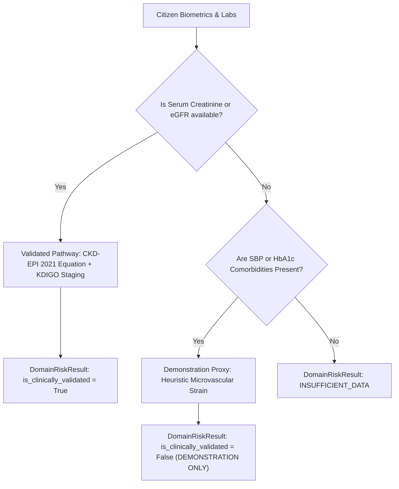

# Model Card: Chronic Kidney Disease (CKD) Risk Model

## 1. Model Details
- **Model Name:** SevaHealth Chronic Kidney Disease & Renal Function Risk Model
- **Identifier:** `KDIGO-CKD-EPI-2024.v1`
- **Domain:** Renal Filtration Staging & Microvascular Progression Risk
- **Model Type:** Dual-Pathway Model (Validated Biomarker Staging + Demonstration Comorbidity Proxy)
- **Validation Status:**
  - `CLINICALLY_VALIDATED` when serum creatinine / eGFR is present.
  - `DEMONSTRATION_ONLY` when evaluated via microvascular comorbidity proxy in field screening without lab assays.
- **Clinical Governance:** Kidney Disease: Improving Global Outcomes (KDIGO) 2024 Clinical Practice Guideline for the Evaluation and Management of Chronic Kidney Disease & CKD-EPI Collaboration

## 2. Intended Use & Clinical Scope
- **Intended Purpose:** Detection of silent decline in estimated Glomerular Filtration Rate (eGFR), early diabetic nephropathy, and hypertensive nephrosclerosis.
- **Intended Users:** Primary Care Clinicians, Community Screening Teams, Nephrologists.
- **Out-of-Scope:**
  - Diagnosis or management of Acute Kidney Injury (AKI).
  - Dialysis prescription or end-stage kidney replacement therapy planning.

## 3. Clinical Provenance & Evidence Base
1. **KDIGO 2024 Clinical Practice Guideline for the Evaluation and Management of Chronic Kidney Disease**: Kidney Int. 2024;105(4S):S117-S314.
2. **CKD-EPI 2021 Race-Free Creatinine Equation**: Inker LA, et al. *New Creatinine- and Cystatin C–Based Equations to Estimate GFR without Race*. N Engl J Med. 2021;385:1737-1749.
3. **ADA/KDIGO Consensus on Diabetes and Chronic Kidney Disease**: De Boer IH, et al. *Diabetes Care*. 2022;45(12):3075-3090.

## 4. Input Variables & Physiological Boundaries
| Input Feature | Canonical Unit | Mandatory? | Physiological Range | Clinical Staging Cutoff |
| :--- | :--- | :--- | :--- | :--- |
| `EGFR` | mL/min/1.73m² | Preferred | $[2, 200]$ | $\ge 90$ (G1), $60-89$ (G2), $45-59$ (G3a), $30-44$ (G3b), $< 30$ (G4-G5) |
| `SERUM_CREATININE` | mg/dL | Preferred | $[0.1, 20.0]$ | Used to compute eGFR via 2021 CKD-EPI equation when eGFR not directly reported |
| `AGE` | years | Conditional | $[1, 125]$ | Equation cofactor |
| `SEX` | categorical | Conditional | MALE / FEMALE | Equation cofactor ($k=0.7$ female, $0.9$ male; $\alpha=-0.241$ female, $-0.302$ male) |
| `SYSTOLIC_BP` | mmHg | Demo Proxy | $[60, 280]$ | Microvascular strain indicator |
| `HBA1C` | % | Demo Proxy | $[3.0, 20.0]$ | Microvascular strain indicator |

## 5. Dual-Pathway Architecture & Demonstration Tagging

> [!WARNING]
> When lab filtration markers are unavailable, the model clearly tags the result as **`DEMONSTRATION ONLY`**, explicitly recording this in limitations and provenance to ensure full clinical transparency and prevent unsupported claims.

## 6. Output Stratification
- **`LOW`** ($\text{Score} < 0.25$): $eGFR \ge 90\text{ mL/min/1.73m²}$ (KDIGO G1 Normal).
- **`MODERATE`** ($0.25 \le \text{Score} < 0.65$): $eGFR\ 60-89$ (G2 Mild) or $45-59$ (G3a) or microvascular comorbidity strain in demonstration proxy.
- **`HIGH`** ($\text{Score} \ge 0.65$): $eGFR < 60\text{ mL/min/1.73m²}$ (G3b–G5 Chronic Kidney Disease). Triggers urgent clinical escalation.
- **`INSUFFICIENT_DATA`**: Neither filtration biomarkers nor cardiovascular comorbidities provided.

## 7. Limitations & Caveats
- Urine Albumin-to-Creatinine Ratio (uACR) is essential for complete KDIGO heat-map staging ($A1, A2, A3$) but infrequently measured in village screening camps.
- Muscle mass extremes (amputees, bodybuilders, severe sarcopenia) skew serum creatinine-based eGFR.
- Demonstration proxy is heuristic and **never presented as clinically validated**.

## 8. Clinical Safety Notice
> **SAFETY NOTICE: Risk estimation is NOT diagnosis.**
> Calculated eGFR is an estimation of renal filtration. It does not replace comprehensive nephrological evaluation and urinary sediment examination.
