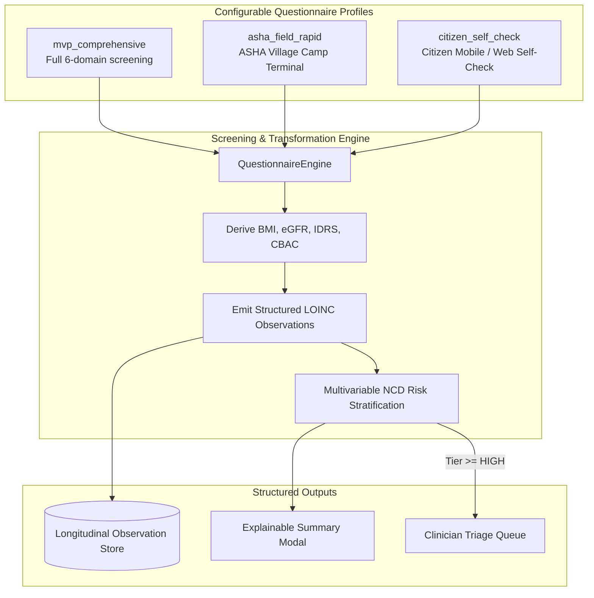

# SevaHealth AI: Configurable NCD Screening Engine

## 1. Executive Summary & Design Principles

The **SevaHealth AI NCD Screening Engine** is a schema-driven, non-hardcoded preventive healthcare intake system. Designed for the **Seva First Innovation Challenge**, it powers early detection across non-communicable and lifestyle-oriented diseases (Type 2 Diabetes, Hypertension, ASCVD, Metabolic Syndrome, Chronic Kidney Disease, and Steatotic Liver Disease).

### Core Architectural Principles:
1. **Configurable Questionnaire Schema (Not Hardcoded in UI)**: The frontend components never hardcode form fields. Instead, the UI dynamically fetches questionnaire schemas (`QuestionnaireWorkflowProfile`) over REST, rendering inputs, select dropdowns, multi-select checkboxes, sliders, validation boundaries, and units on the fly.
2. **Structured LOINC Observations Output**: Screening inputs are not stored as opaque JSON blobs. Every quantitative and qualitative metric is converted into a standardized, discrete `Observation` tagged with canonical LOINC codes, standardized units, abnormality thresholds, and timestamped provenance.
3. **Automated Clinical Derivations**:
   - **Body Mass Index (BMI)**: Dynamically calculated via $\text{BMI} = \frac{\text{weight}_{\text{kg}}}{(\text{height}_{\text{m}})^2}$ with Asian Indian cutoffs ($< 23.0 \text{ kg/m}^2$).
   - **Estimated Glomerular Filtration Rate (eGFR)**: Auto-calculated using the 2021 CKD-EPI equation when serum creatinine is recorded.
   - **Indian Diabetes Risk Score (IDRS)**: Evaluates age, waist circumference, physical activity, and family history ($0-100$ score; $\ge 60$ indicates High Risk).
   - **Community-Based Assessment Checklist (CBAC)**: Computes national operational checklist score ($0-10$; $\ge 4$ flags primary health referral).
4. **Human-in-the-Loop & Non-Diagnostic Boundary**:
   > [!IMPORTANT]
   > Screening is strictly distinguished from confirmed medical diagnosis. The engine provides probabilistic early warning and clinical decision support. All outputs carry an immutable regulatory advisory and automatically escalate high-risk cases to qualified clinicians for diagnostic confirmation.

---

## 2. MVP Screening Fields & Standard Mapping

| Section | Field | Type | Canonical Unit | LOINC Code | Clinical Reference Target |
| :--- | :--- | :--- | :--- | :--- | :--- |
| **DEMOGRAPHICS** | `age` | NUMBER | `years` | N/A | Completed chronological age |
| | `sex` | SELECT | N/A | N/A | Biological sex for anthropometric thresholds |
| **ANTHROPOMETRY**| `height` | NUMBER | `cm` | `8302-2` | Standing height barefoot |
| | `weight` | NUMBER | `kg` | `29463-7` | Calibrated digital scale |
| | `bmi` | NUMBER (Derived) | `kg/m2` | `39156-5` | $< 23.0 \text{ kg/m}^2$ (South Asian normal) |
| | `waist_circumference` | NUMBER | `cm` | `8280-0` | $< 90 \text{ cm}$ (Male), $< 80 \text{ cm}$ (Female) |
| **VITALS** | `systolic_bp` | NUMBER | `mmHg` | `8480-6` | $< 120 \text{ mmHg}$ |
| | `diastolic_bp` | NUMBER | `mmHg` | `8462-4` | $< 80 \text{ mmHg}$ |
| | `heart_rate` | NUMBER | `beats/min` | `8867-4` | $60 - 100 \text{ bpm}$ |
| **LABS** | `fasting_glucose` | NUMBER | `mg/dL` | `1558-6` | $< 100 \text{ mg/dL}$ (Impaired: $100-125$) |
| | `hba1c` | NUMBER | `%` | `4548-4` | $< 5.7\%$ (Prediabetes: $5.7-6.4\%$) |
| | `total_cholesterol` | NUMBER | `mg/dL` | `2093-3` | $< 200 \text{ mg/dL}$ |
| | `ldl_cholesterol` | NUMBER | `mg/dL` | `13457-7` | $< 100 \text{ mg/dL}$ |
| | `hdl_cholesterol` | NUMBER | `mg/dL` | `2085-9` | $\ge 40 \text{ mg/dL}$ (M), $\ge 50 \text{ mg/dL}$ (F) |
| | `triglycerides` | NUMBER | `mg/dL` | `2571-8` | $< 150 \text{ mg/dL}$ |
| | `serum_creatinine` | NUMBER | `mg/dL` | `2160-0` | $0.6 - 1.2 \text{ mg/dL}$ |
| | `egfr` | NUMBER (Derived) | `mL/min/1.73m2` | `33914-3` | $\ge 90 \text{ mL/min/1.73m}^2$ (CKD-EPI) |
| **LIFESTYLE** | `physical_activity` | SELECT | `min/week` | `89555-7` | $\ge 150 \text{ min/week}$ moderate exercise |
| | `diet_quality` | SELECT | N/A | N/A | Carbohydrate quality, whole grains & millets |
| | `sleep_hours` | SLIDER | `hours` | `93832-4` | $\ge 7.0 \text{ hours/night}$ |
| | `smoking` | SELECT | N/A | N/A | Complete tobacco abstinence |
| | `alcohol` | SELECT | N/A | N/A | Alcohol consumption frequency |
| | `stress_level` | SLIDER | `score` | `76542-0` | $\le 4.0 / 10$ perceived stress rating |
| **HISTORY** | `family_history` | MULTI_SELECT | N/A | N/A | Hereditary diabetes, HTN, premature CAD |
| | `known_conditions` | MULTI_SELECT | N/A | N/A | Confirmed comorbidities |
| | `medication_history`| MULTI_SELECT | N/A | N/A | Prescription & traditional formulations |

---

## 3. Workflow Profiles & Roles

The engine provides 3 pre-configured workflow profiles:

1. **`asha_field_rapid` (Health Worker)**:
   - Designed for low-connectivity community field camps.
   - Streamlined inputs: Anthropometry, Vitals, Capillary Glucose, CBAC & IDRS checklists.
   - Instant referral prompt if $\text{CBAC} \ge 4$ or $\text{IDRS} \ge 60$.
2. **`citizen_self_check` (Citizen)**:
   - Intuitive, friendly interface with visual sliders and explanatory hints.
   - Live BMI preview as height/weight controls are adjusted.
   - Immediate explainable risk breakdown.
3. **`mvp_comprehensive` (PHC Clinician & Complete Intake)**:
   - Exhaustive diagnostic profile covering lipid fractions, renal markers, and complete medical history.

---

## 4. Explainable Summary Architecture

Upon screening submission, the engine synthesizes an **Explainable Summary** (`ExplainableScreeningSummary`):
- **Composite Risk Index & Tier**: Calculated multivariable score ($0.0 - 1.0$) mapped to `LOW`, `MODERATE`, `HIGH`, or `CRITICAL`.
- **Longitudinal Trajectory Trend**: `IMPROVING`, `STABLE`, or `DETERIORATING`.
- **Top Contributing Risk Drivers**: Each driver reports observed values, target thresholds, percentage impact weight, and clinical evidence citations (e.g., *ICMR Guidelines 2023*, *AHA/ACC 2017 Blood Pressure Guidelines*).
- **Protective Mitigating Factors**: Quantifies positive behaviors (e.g., *Tobacco Abstinence*, *WHO Physical Activity Adherence*).
- **Actionable Next Steps**: Formulates immediate nutritional and physical activity guidance alongside confirmatory diagnostic follow-ups (e.g. Oral Glucose Tolerance Test).
- **Regulatory Safety Notice**: Explicit disclaimer that results represent probabilistic screening rather than a confirmed diagnosis.

---

## 5. 5–10 Minute Demo Screening Workflow

To allow rapid evaluator verification during the challenge, the platform provides 3 pre-built personas executable in 1 click:
1. **ASHA Camp (`rajesh_kumar_asha`)**: 51-year-old male with prediabetic impaired fasting glucose ($118 \text{ mg/dL}$), systolic hypertension ($142 \text{ mmHg}$), waist circumference $98 \text{ cm}$, IDRS score $80/100$, escalated to Clinician Queue.
2. **Citizen Self-Check (`sunita_sharma_citizen`)**: 44-year-old female with elevated vascular pressure ($136/88 \text{ mmHg}$) and chronic stress score $8/10$.
3. **PHC Comprehensive (`vikram_singh_clinic`)**: 54-year-old male with dyslipidemia (triglycerides $210 \text{ mg/dL}$), eGFR $92 \text{ mL/min}$, and central obesity.

---

## 6. Verification Results

| Test Module | Coverage | Status |
| :--- | :--- | :--- |
| `test_questionnaire_config_profiles` | Verifies dynamic schema delivery across all 3 workflow profiles and 6 sections | **PASSED** |
| `test_automatic_derivations` | Verifies BMI, CKD-EPI eGFR, IDRS ($80/100$), and CBAC ($\ge 4$) calculations | **PASSED** |
| `test_configurable_submission_and_structured_observations` | Verifies dynamic submission generates $\ge 12$ LOINC observations with standard units | **PASSED** |
| `test_explainable_summary_generation` | Verifies drivers, protective factors, and clinical safety notice | **PASSED** |
| `test_demo_screening_scenarios` | Verifies 1-click execution for all 3 demonstration personas | **PASSED** |
| **Total Platform Suite** | **68 passed tests** across entire monorepo | **PASSED (100%)** |
