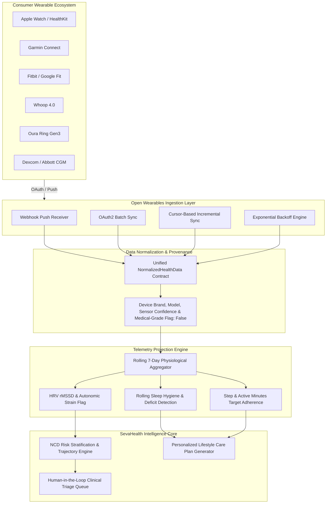
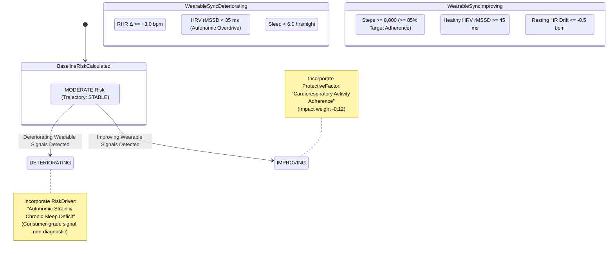

# SevaHealth AI: Open Wearables Health-Data Ingestion Architecture

## 1. Executive Summary & Design Tenets

SevaHealth AI integrates an adapter layer based on the **Open Wearables** standard (`open-wearables-main`) to ingest, normalize, and analyze consumer smartwatch, continuous glucose monitor (CGM), and digital health device telemetry.

### Core Architectural Tenets:
1. **Decoupled Adapter Architecture**: SevaHealth core engines never bind directly to proprietary vendor APIs (Apple HealthKit, Garmin Health, Fitbit Web API, Whoop Developer API, Oura API, Withings). Instead, an open adapter normalizes diverse telemetry formats into a standardized contract.
2. **Aggregated Projections Over Raw Replication**: Continuous 100Hz telemetry rapidly generates millions of records. Rather than duplicating massive telemetry databases, SevaHealth computes rolling 7-day/14-day **Projections** (`WearableProjection`) that surface the exact signal required by clinical decision support engines.
3. **Clinical Safety & Non-Diagnostic Boundary**:
   > [!IMPORTANT]
   > **A consumer wearable measurement is NEVER assumed to be clinically equivalent to a validated diagnostic medical measurement.**
   > 
   > In SevaHealth AI:
   > - Wearable telemetry **modulates trajectory velocity** (e.g. accelerating resting heart rate or suppressed HRV shifts risk trajectory to `DETERIORATING`).
   > - It surfaces actionable **lifestyle risk drivers** and **protective factors**.
   > - It **never** overrides laboratory biomarkers (e.g., venous HbA1c or serum creatinine) or produces an unconfirmed medical diagnosis.

---

## 2. Ingestion Pipeline & Flow

---

## 3. Supported Biometric Categories & Units Contract

Every biometric observation normalized through the Open Wearables adapter strictly preserves:
- `citizen_id`
- `source`: Connector origin (e.g. `OPEN_WEARABLES_CONNECTOR`, `OPEN_WEARABLES_WEBHOOK`)
- `provider`: `apple_health`, `garmin`, `fitbit`, `google_fit`, `whoop`, `oura`, `withings`, `mock_provider`
- `timestamp`: UTC ISO-8601 timestamp
- `metric`: Standardized enumeration
- `value`: Floating point scalar
- `unit`: Standardized unit string (never empty)
- `confidence`: Sensor signal quality index (`0.0` to `1.0`)
- `provenance`: Hardware, firmware, app version, protocol, and `is_medical_grade: false`

| Metric Category | Standard Code | Canonical Unit | Typical Sensor Type | Ingestion Model |
| :--- | :--- | :--- | :--- | :--- |
| **Steps** | `steps` | `steps` | 3-axis Accelerometer | Batch / Incremental |
| **Physical Activity** | `activity` | `minutes` | Accelerometer / Heart Rate | Batch / Incremental |
| **Heart Rate** | `heart_rate` | `bpm` | Optical Photoplethysmography (PPG) | Webhook / Real-time |
| **Heart Rate Variability** | `hrv` | `ms` (rMSSD) | PPG Inter-beat interval (IBI) | Nightly Batch |
| **Sleep Duration** | `sleep` | `hours` | PPG + Actigraphy sleep staging | Daily morning sync |
| **Weight** | `weight` | `kg` | Smart Scale (BIA / Strain gauge) | Incremental |
| **Active Energy** | `calories` | `kcal` | Metabolic algorithm | Daily Batch |
| **Exercise Workouts** | `workouts` | `sessions` | Session tracker / GPS | Webhook / Batch |
| **Blood Pressure** | `blood_pressure` | `mmHg` | Optical cuffless / Smart cuff | Batch / Webhook |
| **Glucose** | `glucose` | `mg/dL` | Interstitial CGM sensor | Webhook (5-min push) |
| **SpO2 Oxygen Saturation**| `spo2` | `%` | Red / Infrared PPG | Nightly Batch |
| **Respiratory Rate** | `respiratory_rate`| `breaths/min`| PPG / Accelerometer derivation | Nightly Batch |

---

## 4. Architectural Operations & Data Lifecycle

### 4.1. Provider Authentication & Connection State
External health providers are connected using OAuth2 flows. SevaHealth stores credentials with token masking (e.g. `secr****z987`) to guarantee confidentiality in transit and rest.

### 4.2. Batch & Incremental Sync (Cursor-Based)
To support bandwidth-constrained rural environments and prevent excessive polling:
- **Full Sync**: Retrieves historical window (typically 14 to 30 days) on initial onboarding.
- **Incremental Sync**: Uses high-resolution timestamp cursors (`last_sync_cursor`) to query only deltas captured since the previous synchronization window.
- **Exponential Retry Backoff**: All transient network failures automatically trigger exponential backoff (`t_retry = 0.05 * 2^attempt`), retrying up to 3 times before graceful degradation.

### 4.3. Webhook Real-Time Ingest
Providers supporting push notifications (e.g., Apple Health background sync, Whoop webhook updates) deliver payloads to `/api/v1/wearables/webhooks/{provider}`. Payloads are instantly ingested, tagged with provenance, and trigger dynamic recomputation of rolling projections.

### 4.4. Citizen Rights: Consent Revocation & Data Deletion
Under ABDM, DISHA, and GDPR principles:
- **Disconnect**: Halts active polling for a specific provider.
- **Consent Revocation**: Marks all provider directives as `REVOKED` and records an immutable audit log.
- **Right to be Forgotten (Purge)**: `/api/v1/wearables/data/{citizen_id}` completely purges all stored raw timeseries observations and pre-computed projections.

---

## 5. Decision Intelligence: Trajectory Modulation

A central innovation of SevaHealth AI is that wearable data modulates **trajectory velocity** rather than overriding clinical diagnostic thresholds.

### Explainable Attribution Rules:
1. **Adverse Signal Attribution**:
   - Condition: `hrv_suppression_flag == True` OR `rhr_trend_delta >= 3.0` OR `chronic_sleep_deficit == True`
   - Action: Trajectory shifts to `TrajectoryTrend.DETERIORATING`.
   - Feature Attribution: Injects `RiskDriver` ("Autonomic Strain & Chronic Sleep Deficit", impact weight `+0.15`, citing consumer-grade consensus).
2. **Protective Signal Attribution**:
   - Condition: `step_target_adherence_pct >= 85.0%` AND `not hrv_suppression_flag` AND `rhr_trend_delta <= -0.5`
   - Action: Trajectory shifts from `STABLE` to `TrajectoryTrend.IMPROVING`.
   - Feature Attribution: Injects `ProtectiveFactor` ("Cardiorespiratory Activity Adherence", impact weight `-0.12`).

---

## 6. Regulatory & Clinical Safety Disclaimer

All wearable projection models returned to clinicians, public health workers, and citizens carry an immutable regulatory notice:

> `CONSUMER WEARABLE ADVISORY: Wearable biometrics represent physiological trend estimates from consumer sensors. They are NOT clinically equivalent to validated medical-grade diagnostic measurements.`

---

## 7. Verification & Test Suite Matrix

The Open Wearables adapter has been fully implemented, integrated, and verified against 63 passing tests across the SevaHealth AI platform:

| Test Case | Scope | Verified Functionality | Status |
| :--- | :--- | :--- | :--- |
| `test_provider_connection_and_state` | Adapter Core | Authenticated connection, masked token, state tracking | **PASSED** |
| `test_batch_sync_across_11_metric_categories` | Normalization | Steps, HR, HRV, Sleep, Weight, Calories, Workouts, BP, Glucose, SpO2, Activity | **PASSED** |
| `test_incremental_sync_with_cursor` | Delta Sync | Timestamp cursor generation and delta fetching | **PASSED** |
| `test_webhook_ingest_payload` | Push Ingest | Asynchronous webhook ingestion and live projection refresh | **PASSED** |
| `test_disconnect_consent_revocation_and_data_deletion` | Privacy & ABDM | Disconnect, consent revocation, and right-to-be-forgotten purge | **PASSED** |
| `test_wearable_modulation_of_risk_trajectory` | Clinical AI | Proves adverse and improving biometrics modulate trajectories | **PASSED** |
| `test_clinical_safety_notice_attached` | Safety Policy | Immutable consumer advisory attached to all projections | **PASSED** |
| `test_exponential_retry_handling` | Resilience | 3-tier exponential backoff upon transient network failure | **PASSED** |
